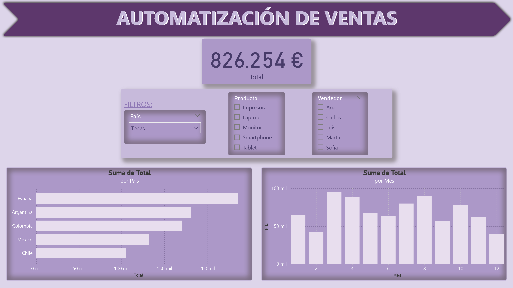

# Proyecto Dashboard de Ventas con Power BI

Este proyecto forma parte de mi portfolio como analista de datos en formación.

## Descripción
- Limpieza y transformación de datos usando Python (pandas).
- Visualización interactiva con Power BI.
- Dataset: ventas con detalles por producto, país, vendedor y fecha.

## Archivos incluidos
- `datos/ventas_limpias.xlsx`: datos limpios listos para análisis.
- `python/limpieza_ventas.py`: script para limpieza y preparación de datos.
- `powerbi/dashboard_ventas.pbix`: archivo del proyecto Power BI con visualizaciones.

## Herramientas utilizadas
- Python 3 + pandas
- Power BI Desktop

## Resultados destacados
- Visualizaciones claras por país, producto, mes y vendedor.
- Dashboard interactivo con filtros para exploración dinámica.

## Vista general del Dashboard

## Cómo ejecutar
1. Ejecuta el script Python para generar el archivo limpio (opcional si ya tienes el Excel).
2. Abre el archivo `.pbix` en Power BI para explorar el dashboard.

Nota: Como estoy en formación, en el script podrás ver muchísimos comentarios para explicar qué hacen ciertas cosas.