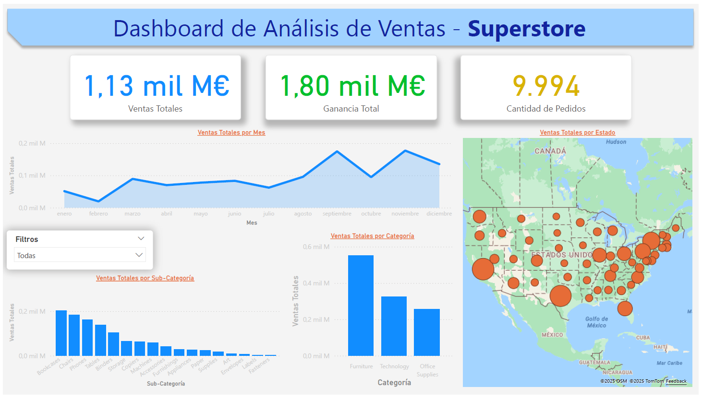

# 📊 Dashboard de Ventas – Superstore (Power BI)

Este proyecto forma parte de mi portfolio como analista de datos en formación. El objetivo es analizar los datos de ventas de una tienda global utilizando Power BI, identificando patrones y generando visualizaciones interactivas que ayuden a la toma de decisiones.

---

## 📁 Dataset

- **Archivo:** SampleSuperstore.csv
- **Fuente:** Kaggle  
  [https://www.kaggle.com/datasets/vivek468/superstore-dataset-final](https://www.kaggle.com/datasets/vivek468/superstore-dataset-final)

---

## 🧰 Herramientas utilizadas

- Power BI Desktop  
- Power Query (para transformación de datos)  
- DAX (para cálculos y medidas personalizadas)

---

## 🔍 Objetivos del análisis

- Ver la evolución de las ventas a lo largo del tiempo
- Identificar las categorías y productos más rentables
- Analizar el rendimiento por región y estado
- Evaluar la distribución de pedidos por segmento de cliente

---

## 📊 Visualizaciones

- 📌 **KPIs principales**: Ventas totales, ganancias, número de pedidos
- 📈 **Gráfico de líneas**: Ventas mensuales por año
- 📦 **Barras por categoría y subcategoría**: Productos más vendidos
- 🗺️ **Mapa geográfico**: Ingresos por estado
- 🧭 **Segmentadores**: Año, categoría, región, segmento de cliente

---

## 📸 Capturas del dashboard

### Vista general

> Puedes ver más imágenes en la carpeta `/imagenes`.

---

## 📌 Aprendizajes

- Limpieza y transformación de datos en Power Query
- Gestión de errores de formato en fechas internacionales
- Cálculo de medidas personalizadas con DAX
- Diseño de dashboards con visuales coherentes e interactivos

---

## 🤝 Conecta conmigo

Si compartes interés por el análisis de datos, ¡me encantaría conectar!  
[LinkedIn](https://www.linkedin.com/in/diego-data-analyst/)

diegotrbass2@gmail.com

---

