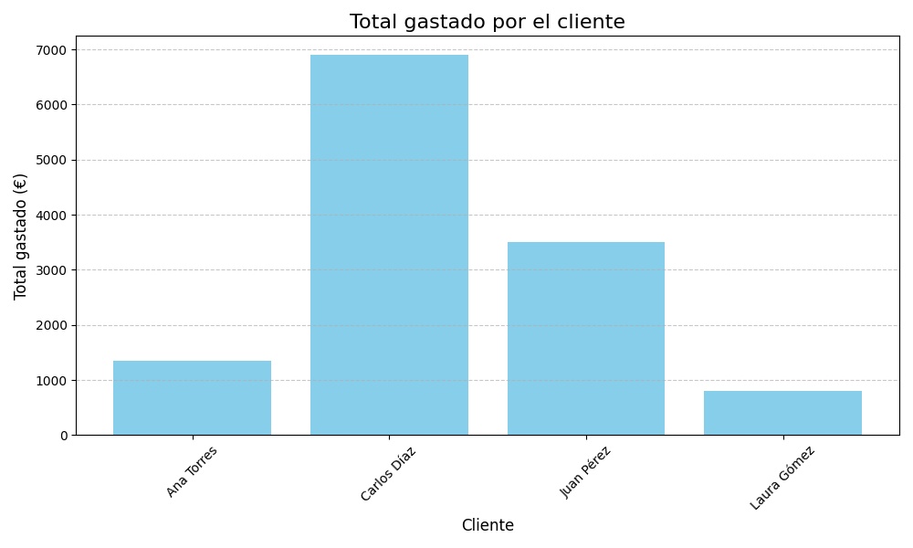

# Análisis de Ventas - Tienda MySQL + Python 📊

Este proyecto realiza un análisis detallado de ventas de una tienda online almacenadas en una base de datos MySQL. Utiliza Python para conectar con la base de datos, manipular datos y generar visualizaciones útiles. El objetivo es proporcionar insights sobre el comportamiento de compra de los clientes y facilitar la toma de decisiones empresariales.

## 🎯 Objetivo

El principal objetivo de este proyecto es:
1. **Conectar con una base de datos MySQL** que contiene información sobre pedidos, clientes, productos y detalles de pedidos.
2. **Analizar los datos** para calcular cuánto gastó cada cliente en productos.
3. **Generar resultados visuales y exportables:**
   - Un gráfico de barras que muestra el total gastado por cada cliente.
   - Un archivo CSV con los totales gastados por cliente para futuras referencias.

Este proyecto es ideal para pequeñas empresas o tiendas que deseen comprender mejor sus ventas y el comportamiento de sus clientes.

---

## 🔧 Tecnologías utilizadas

- **Python:** Lenguaje de programación utilizado para el análisis y visualización de datos.
- **MySQL:** Base de datos donde se almacenan los datos de ventas.
- **Seaborn y Matplotlib:** Bibliotecas para generar gráficos elegantes y fáciles de entender.
- **SQLAlchemy:** Biblioteca que facilita la conexión entre Python y MySQL.
- **pandas:** Herramienta para manipular y analizar datos en formato tabular.

---

## Revisar los resultados

Los totales gastados por cliente se guardarán en un archivo CSV (resultados/total_por_cliente.csv).
Un gráfico de barras mostrará visualmente los resultados en la consola.

---

## 📊 Resultados esperados

1. Totales por cliente
El programa calcula cuánto gastó cada cliente y guarda los resultados en un archivo CSV. Esto te permite analizar quiénes son tus clientes más valiosos.

2. Gráfico de barras
Un gráfico claro y visual muestra el total gastado por cada cliente. Es perfecto para presentaciones o informes.

Aquí tienes una captura de pantalla del gráfico generado:

---

## Uso de autopep8

En mis proyectos utilizo la extensión autopep8 para VSCode.
Esta es una herramienta para Python que formatea automáticamente el código para que cumpla con la guía de estilo PEP 8.
En esencia, autopep8 ayuda a mantener un código Python limpio y consistente, siguiendo las recomendaciones de PEP 8, que es la guía oficial de estilo para Python.

En este caso específico, he configurado para que las líneas de código no muestren advertencias cuando sobrepasan los 79 caracteres y la he configurado a 140 caracteres.

---

## 🤝 Conecta conmigo

Si compartes interés por el análisis de datos, ¡me encantaría conectar!  
[LinkedIn](https://www.linkedin.com/in/diego-data-analyst/)

diegotrbass2@gmail.com
